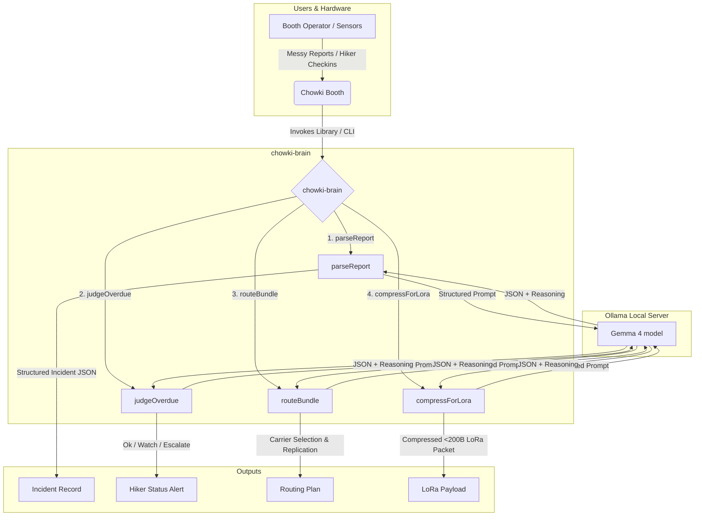
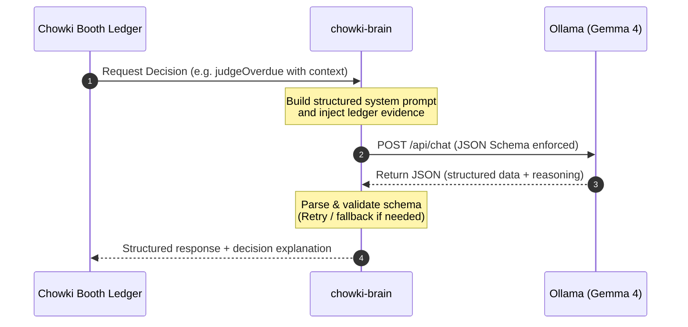

# chowki-brain

A TypeScript library + CLI wrapping a local Gemma 4 model (served by [Ollama](https://ollama.com)) to power decision-making for `chowki` — a delay-tolerant mesh network for mountain trail booths. This is the only tool in the system that talks to the model.

## System Architecture & Visual Flow



## Decision Loop Sequence




Four typed functions, each returning structured JSON **plus** a `reasoning` string:

- `parseReport` — turn a messy, often Hinglish incident report into a structured record.
- `judgeOverdue` — decide whether an overdue hiker is `ok` / `watch` / `escalate` by weighing
  conflicting ledger evidence, not a simple time threshold.
- `routeBundle` — pick which human carriers should physically relay a data bundle, and how many
  redundant copies to hand out.
- `compressForLora` — compress a bundle into a tiny "triage packet" that fits in 200 bytes for
  transmission over LoRa radio.

## Requirements

- Node.js >= 18
- [Ollama](https://ollama.com) running locally with a Gemma 4 model pulled, e.g.:
  ```bash
  ollama pull gemma4:e2b
  ```
  Run `ollama list` to confirm the exact tag on your machine and set `GEMMA_MODEL` accordingly if
  it differs.

## Install

```bash
npm install
npm run build
```

## Configuration

Copy `.env.example` and adjust as needed (or just export the variables):

| Variable         | Default                  | Purpose                                              |
|------------------|---------------------------|-------------------------------------------------------|
| `OLLAMA_HOST`    | `http://localhost:11434`  | Base URL of the Ollama server                         |
| `GEMMA_MODEL`    | `gemma4:e2b`              | Model tag to call                                     |
| `BRAIN_FALLBACK` | `0`                       | Set to `1` to skip Ollama and return canned responses |

## Library usage

```ts
import { parseReport, judgeOverdue, routeBundle, compressForLora } from "chowki-brain";

const { incident, reasoning } = await parseReport({
  text: "some foreigner near the waterfall twisted his leg badly, he was alone i think, maybe 2km up",
  boothId: "booth-2"
});
```

## CLI usage

```bash
npx chowki-brain parse "<text>" [--booth <boothId>]
npx chowki-brain judge <path-to-json>    # { "hiker": HikerCheckin, "ledgerContext": string }
npx chowki-brain route <path-to-json>    # { "bundle": Bundle, "carriers": CarrierInfo[] }
npx chowki-brain compress <path-to-json> # { "bundle": Bundle }
```

Latency for each call is logged to stderr (`[chowki-brain] <fn> took <ms>ms`); the JSON result +
reasoning is printed to stdout.

### Example: `parse`

```console
$ npx chowki-brain parse "some foreigner near the waterfall twisted his leg badly, he was alone i think, maybe 2km up" --booth booth-2
{
  "incident": {
    "kind": "injury",
    "urgency": "urgent",
    "persons": 1,
    "locationHint": "near waterfall, 2km up",
    "boothId": "booth-2",
    "summary": "A foreigner twisted his leg badly near the waterfall."
  },
  "reasoning": "The report explicitly states 'twisted his leg badly', indicating an injury. 'Badly' suggests urgency. 'Alone' suggests one person. Location details are 'near the waterfall' and '2km up'."
}
```

### Example: `judge` (`fixtures/asha.json`)

```console
$ npx chowki-brain judge fixtures/asha.json
{
  "status": "watch",
  "recommendAction": "radio booth 5 to confirm sighting and status",
  "reasoning": "Asha Rawat is overdue. While a porter reported a sighting near booth 5 two hours prior, there is no direct confirmation of her current status. The weather reports light snow flurries, and the lack of a recent check-in warrants monitoring before escalating."
}
```

### Example: `route` (`fixtures/bundle1.json`, an SOS bundle with 4 candidate carriers)

```console
$ npx chowki-brain route fixtures/bundle1.json
{
  "carrierIds": [
    "carrier-1",
    "carrier-2"
  ],
  "replicationFactor": 2,
  "reasoning": "This is a 'sos' priority bundle. I selected carrier-1 and carrier-2 because they are both moving downhill, which is the direction toward potential help. Carrier-1 is noted as 'moves fast, solo, trail runner', making them a reliable choice. Carrier-2 is also moving downhill and is noted as 'said he is a doctor', suggesting some level of reliability. I am providing a replication factor of 2 to ensure redundancy for this critical situation."
}
```

### Example: `compress` (same bundle, packed for LoRa)

```console
$ npx chowki-brain compress fixtures/bundle1.json
{
  "packet": {
    "k": "sos",
    "u": "crit",
    "p": 1,
    "loc": "wtrfall+2km",
    "b": "2"
  },
  "bytes": 56,
  "reasoning": "Used shortest codes for kind, urgency, persons, and location. 'wtrfall+2km' is the most concise location hint."
}
```

If the model's first attempt serializes over 200 bytes, `compressForLora` re-prompts once asking
Gemma to shorten `loc`, then falls back to hard character-truncation of `loc` as a last resort —
`bytes` always reflects the actual serialized size of the returned packet.

## Fallback mode

Set `BRAIN_FALLBACK=1` to make all four functions return canned-but-valid responses without
calling Ollama, so other tools in the system can integrate against this library before (or
without) a model running:

```bash
BRAIN_FALLBACK=1 npx chowki-brain judge fixtures/asha.json
```

## Testing

```bash
npm test
```

Runs against fixtures in both fallback mode and — if Ollama is reachable — against the real
model, including the required regression fixture that `parseReport` must correctly classify a
messy Hinglish injury report as `kind: "injury"`, `urgency: "urgent"`, `persons: 1`, with a
`locationHint` referencing the waterfall/distance. If Ollama isn't reachable, the real-model test
is skipped automatically.

## Project structure

```
src/
  types.ts               shared types
  ollamaClient.ts         Ollama chat wrapper: format=json, temp 0.2, one retry on parse/schema error
  prompts/*.prompt.ts     reviewable prompt templates, one per function
  functions/*.ts          the four public functions
  fallback/fixtures.ts    BRAIN_FALLBACK=1 canned responses
  index.ts                public API
  cli.ts                  CLI entry point
fixtures/                 sample inputs used by the CLI examples and tests
tests/                    vitest suite
```

## Out of scope

No chat loop, no conversation memory, no RAG, no embeddings, no streaming UI — four functions,
each a single request/response round trip to the model.
